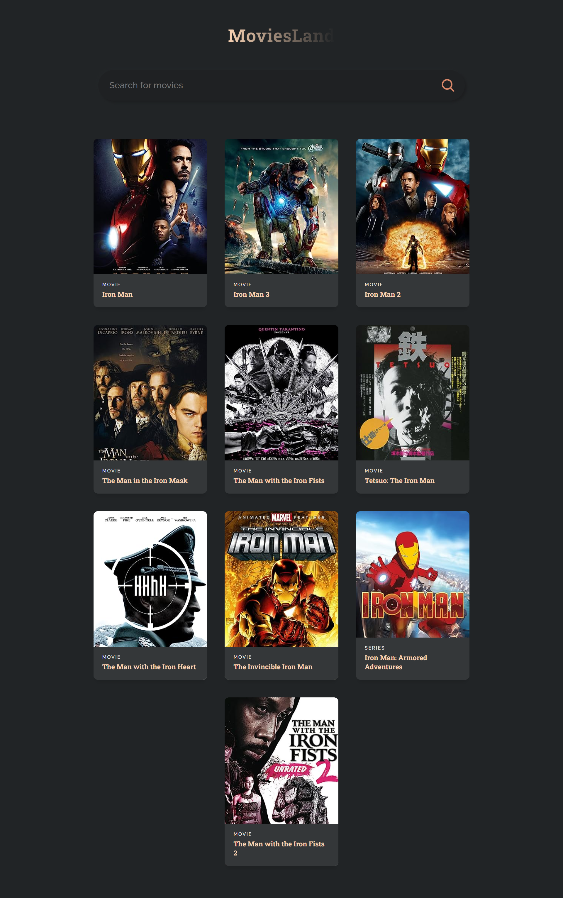

# :closed_book: Movies Land

### _Movies website using React !!_

### Link :link: https://rak-movies.netlify.app/

## Interface

## Run Locally

  - Run This command `https://github.com/developer-rak/movie_land.git`
  - You are now in the dev environment and you can play around

## ✨ Features

  - Search any type of movie you'll find it

## ⚙️ Tech Stack
  - HTML5
  - CSS
  - React
  - APIs (OMDB API for movies)
  - Netlify
